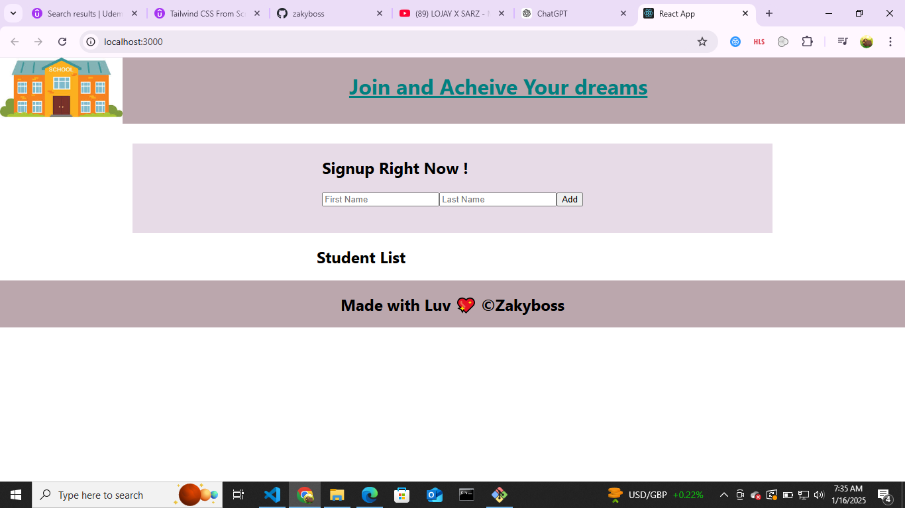
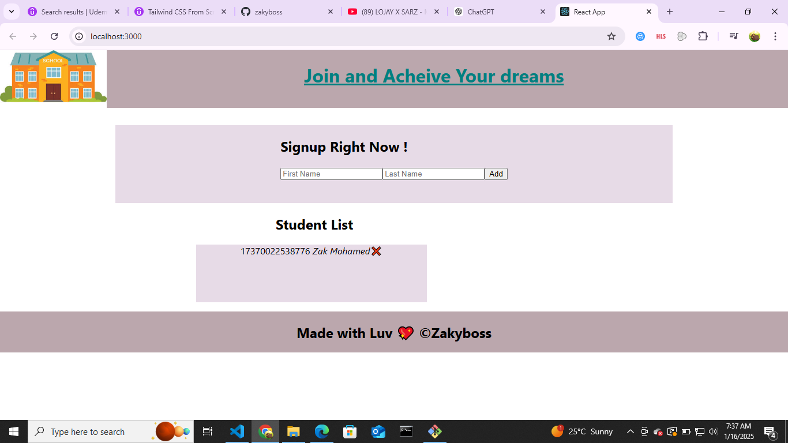

# Student Management App

A simple React application to manage a list of students. This app allows users to add students with their first and last names, assign unique IDs, and display the list of students.

## Features

- Add a student by providing their first and last name.
- Automatically generates a unique ID for each student.
- Displays a list of added students.
- Simple and intuitive user interface.

## Screenshots 



## Installation

1. Clone this repository to your local machine:
   ```bash
   git clone <repository_url>
Navigate to the project directory:
bash
Copy
Edit
cd student-management-app
Install the dependencies:
bash
Copy
Edit
npm install
Usage
Start the development server:
bash
Copy
Edit
npm start
Open your browser and navigate to http://localhost:3000.
Project Structure
css
Copy
Edit
src/
├── components/
│   ├── Header.js
│   ├── Footer.js
│   ├── Form.js
│   ├── StudentList.js
│   └── Student.js
├── App.js
├── index.js
├── styles.css
Header.js: Displays the application header.
Footer.js: Displays the footer section.
Form.js: Contains the form for adding students.
StudentList.js: Displays the list of all students.
Student.js: Represents an individual student in the list.
Components Breakdown
App.js
The main component that manages state and renders the header, form, student list, and footer.

Form.js
Handles user input for adding new students. Includes:

firstName input field
lastName input field
Submit button to add a student
StudentList.js
Iterates over the array of students and renders individual Student components.

Student.js
Displays the details of an individual student, including:

firstName
lastName
A unique ID.
Technologies Used
React: For building the user interface.
JavaScript: For handling application logic.
CSS: For styling components.
How It Works
The user enters a first and last name in the form fields.
Clicking "Add" generates a unique ID for the student and adds them to the student list.
The list of students is displayed dynamically below the form.
Future Improvements
Add functionality to mark students as admitted.
Allow deletion of students from the list.
Add persistence using local storage or a backend API.
License
This project is licensed under the MIT License.

Contribution
Feel free to fork the repository and submit pull requests for improvements or additional features.

Author
Zakariya Mohamed
GitHub: Zakyboss

vbnet
Copy
Edit
